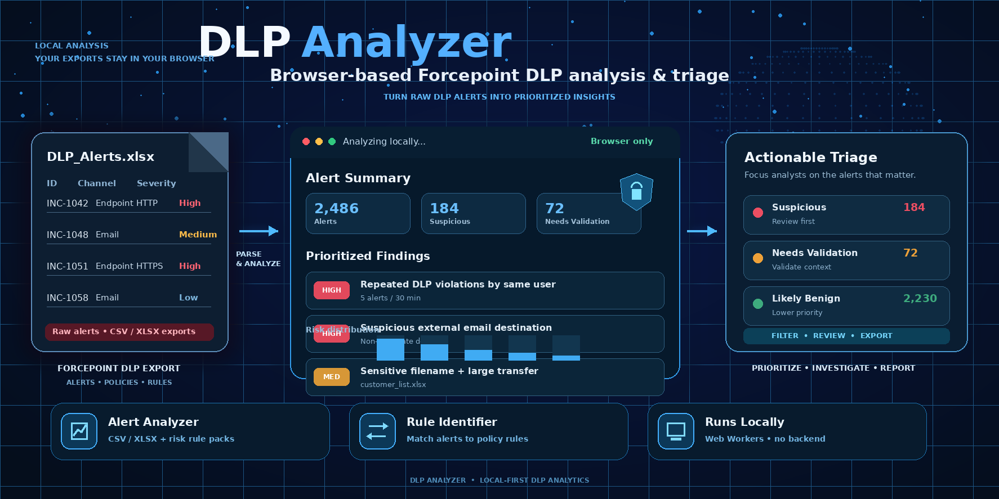

# DLP Analyzer

A collection of browser-based tools for analyzing **Data Loss Prevention (DLP)** data. DLP Analyzer is designed to work with CSV exports from **Forcepoint DLP / Forcepoint Security Manager**, especially incident (alert) exports and policy/rule exports. The Alert Analyzer also accepts XLSX incident exports directly. It is a companion analysis utility, not an official Forcepoint product.

Processing happens in the browser: uploaded file contents are not sent to an application server. The CSV-based tools use the shared local parser in `docs/js/csv-utils.js`. XLSX files are read locally with a local SheetJS browser build (`docs/lib/xlsx.full.min.js`).

## Forcepoint DLP compatibility

DLP Analyzer expects the column names present in Forcepoint DLP exports. In particular:

- **Alert Analyzer** works with incident exports containing fields such as `ID`, `Incident Time`, `Source`, `Policies`, `Destination`, `File Name`, `Details`, `Channel`, `Action`, and `Severity`.
- **DLP Policy Tuning Advisor** groups incident exports by policy and uses deterministic statistics to surface duplicate bursts, recurring triggers, concentrated workflows, generic attachments, and other review opportunities. It never labels an alert as a false positive.
- **Rule Identifier** combines an alert export (including `Violation Triggers` and `Policies`) with a policy/rule export (including `Rule Name`, `Relation`, and `Classifiers`) to add the matching rule name to each alert.
- **Risk Scoring** creates, stores, imports, and exports weighted Boolean predicates, then ranks alerts by the combined weight of every matching rule.

Export labels can vary between Forcepoint versions and configured report templates. If a required column was renamed or omitted, export it again with the expected field names before processing it. All analysis is local and does not modify data in Forcepoint.

## Open the application

To try Alert Analyzer immediately, open the [hosted GitHub Pages version](https://harboot.github.io/DLP-Analyzer/#AlertAnalyzer).

Open `docs/index.html` directly in a web browser. No web server, installation, or build step is required.

`index.html` is the main page and provides navigation to every tool. Individual HTML files in `docs/` can also be opened directly when you only need a specific tool.

When served over HTTPS, including on GitHub Pages, the application prepares all local pages, scripts, styles, rule packs, workers, guides, and samples for offline use on the first visit. Keep that page open until the real caching progress reaches completion. Later visits can load the complete tool set without a network connection. Service Workers are unavailable for pages opened directly with a `file://` URL.

## Project structure

```text
.
├── AGENTS.md                    # Repository language and workflow guidance
├── README.md                    # Project documentation
└── docs/
    ├── index.html               # Main page and tool navigation
    ├── AlertAnalyzer.html
    ├── PolicyTuningAdvisor.html
    ├── CardManager.html
    ├── RuleIdentifier.html
    ├── PolicyViewer.html
    ├── DocViewer.html
    ├── KeywordGenerator.html
    ├── guides/                  # Per-tool user guides
    ├── styles.css               # Shared application styles
    ├── js/                      # Shared and page-specific browser logic
    │   ├── KG_script.js         # Keyword Generator logic
    │   ├── ai.js                # AI-assisted filter generation
    │   ├── csv.js               # Alert ingestion and tab construction
    │   ├── csv-utils.js         # Shared local CSV parser
    │   ├── dlp-utils.js         # Shared DOM and output-safety helpers
    │   ├── risk-scoring.js      # Weighted alert-score aggregation
    │   ├── rules.js             # Alert Analyzer rule execution
    │   ├── storage.js           # Expiring secrets and rule-result cache
    │   ├── ui.js                # Alert Analyzer rendering and interaction
    │   └── utils.js             # Alert Analyzer data helpers and state
    ├── worker/                  # CPU-intensive background processing
    │   ├── AlertAnalyzer.worker.js
    │   └── RuleIdentifier.worker.js
    └── rules/                   # Declarative JSON risk-rule packs
        ├── destination-risk.json
        ├── filename-risk.json
        ├── suspicious-email.json
        └── volume-risk.json
```

## Shared browser utilities

Pages should load `js/dlp-utils.js` before their page-specific script and reuse the
frozen `DLPUtils` namespace instead of defining equivalent helpers again. The
namespace currently provides `query`, `queryAll`, `toText`, `escapeHtml`, and
`sanitizeForTSV`. Keeping these small, general-purpose helpers shared ensures
that selectors and output escaping behave consistently across the tools;
page-specific parsing and rendering logic should remain in each tool's script.

## Page functions

- **Alert Analyzer** imports DLP alert CSV or XLSX files and presents every alert individually alongside summaries, JSON rule-pack findings, filters, charts, and exports. For XLSX workbooks, the first worksheet is imported. Rule packs live in `docs/rules/` and can be extended without changing the analyzer HTML. [Open the Alert Analyzer guide](https://harboot.github.io/DLP-Analyzer/guides/AlertAnalyzerGuide.html).
- **DLP Policy Tuning Advisor** analyzes alert CSV or XLSX exports entirely in the browser and ranks policy-level tuning opportunities with explainable, deterministic rules. Findings include the contributing alerts for analyst review. [Open the Policy Tuning Advisor guide](https://harboot.github.io/DLP-Analyzer/guides/PolicyTuningAdvisorGuide.html).
- **Risk Scoring** generates JavaScript Boolean predicates with optional OpenAI assistance, assigns each rule a weight, stores reusable rule collections, and ranks alerts by the sum of all matching enabled rules. [Open the Risk Scoring guide](https://harboot.github.io/DLP-Analyzer/guides/RiskScoringGuide.html).
- **Rule Identifier** matches alert classifier data to DLP policy rules and exports the enriched alerts. [Open the Rule Identifier guide](https://harboot.github.io/DLP-Analyzer/guides/RuleIdentifierGuide.html).
- **Policy Viewer** imports policy data and provides searchable, filterable policy and rule details. [Open the Policy Viewer guide](https://harboot.github.io/DLP-Analyzer/guides/PolicyViewerGuide.html).
- **Document Viewer** opens supported local documents for quick browser-based inspection. [Open the Document Viewer guide](https://harboot.github.io/DLP-Analyzer/guides/DocViewerGuide.html).
- **Keyword Generator** extracts and ranks useful keywords from supplied text or files. [Open the Keyword Generator guide](https://harboot.github.io/DLP-Analyzer/guides/KeywordGeneratorGuide.html).
